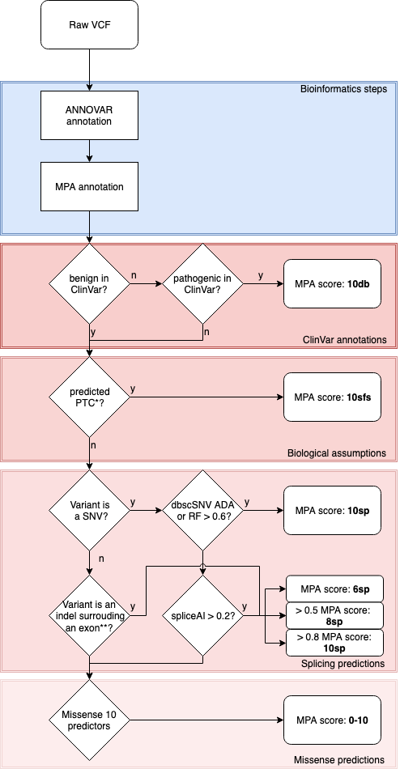

# Welcome to the MoBiDiC Prioritizing Algorithm (MPA) !

- [Welcome to the MoBiDiC Prioritizing Algorithm (MPA) !](#welcome-to-the-mobidic-prioritizing-algorithm-mpa-)
	- [Overview](#overview)
		- [Citing MPA](#citing-mpa)
	- [Installation](#installation)
		- [Requirements](#requirements)
			- [Annotation](#annotation)
		- [Check installation](#check-installation)
		- [Troubleshooting](#troubleshooting)
			- [Python version](#python-version)
			- [Dependencies](#dependencies)
	- [Quick start](#quick-start)
		- [Quick guide for Annovar](#quick-guide-for-annovar)
			- [Install Annovar](#install-annovar)
			- [Download all databases](#download-all-databases)
			- [Annotate a VCF](#annotate-a-vcf)

--------------------------------------------------------------------------------

## Overview

The MPA is a prioritizing algorithm for Next Generation Sequencing molecular
diagnosis. We propose an open source and free for academic user workflow.

Variant ranking is made with a unique score that take into account curated
database, biological assumptions, splicing predictions and the sum of various
predictors for missense alterations. Annotations are made for exonic and
splicing variants up to +300nt.

We show the pertinence of our clinical diagnosis approach with an updated
evaluation of in silico prediction tools using DYSF, DMD, LMNA, NEB and TTN
variants from the human expert-feeded Universal Mutation Database [1] with
courtesy regards of curators for pathogenic variants and from the ExAc database
[2] to define the dataset of neutral variants.



PTC: Premature Truncation Codon : nonsense or frameshift

### Citing MPA

> **Yauy et al.** An algorithm based on an updated evaluation
of prediction tools to prioritize variants with a unique score for TTN and NGS
molecular diagnosis. **(2017)**

### Output example

#### Column 1 - 2: Rank from 1 to 7 and score

- 1 - 10db : Pathogenic variants reported on ClinVar
- 2 - 10sfs : Premature Truncation Codon : nonsense or frameshift
- 3,4,5 - 10spADA, 10spRF, 10sp : Affecting splice variants predictions ranked by algorithm performance robustness
- 6 - 10 to 0 : Missense variants scores
- 7 - U : Exonic variants with not clearly annotated ORFs

#### Column 3 : Gene Name

- RefGene Nomenclature

#### Column 4, 5, 6... (one column per sample) : Genotype
- '0/1 : Heterozygous
- '1/1 : Homozygous
- '. : Variant not called

#### Additional columns

Common variant annotation by the following databases (in order of appearance) :
- ExAc
- ClinVar (ClinSig)
-	Func.refGene : localisation of the variation (exonic, splicing, intronic, UTR, ...)
-	ExonicFunc.refGene : mpact of the variation (synonymous, non-synonymous, stop,
frameshift, non frameshift ...)
-	AAChange.refGene : detailed variation on the transcript and on the protein (c. and p.)
- CHROM POS	REF	ALT
- ADA/RF : Splicing predictions [7]
- Spidex : Splicing predictions [6]
-	Score : Cumulative missense predictions (/10) from dbNFSP [8]
- Number of tools : Number of in silico tools that annotate at this locus

--------------------------------------------------------------------------------

## Installation

To download MPA, please use git to download the most recent development tree.
Currently, the tree is hosted on github, and can be obtained via:

```bash
$ git clone https://github.com/mobidic/MPA.git
```

### Requirements

* Linux or macOS
* Python 3.5
  - Standard Library:
    + argparse
    + csv
	+ os
	+ re
	+ sys
  - Librairies:
    + PyVCF

> To install python librairies see [Dependencies](#dependencies) section.

#### Annotation

The MPA uses, as input, an annotated VCF file with Annovar [3] and the following
databases :

- Curated database: ClinVar [4]
- Biological assumption : refGene [5]
- Splicing predicition : Spidex [6], dbscSNV [7]
- Missense prediction : dbNSFP [8]

> In addition you will need to annotate your VCF with Annovar [8]
(cf. [Quick guide for Annovar](#quick-guide-for-annovar)).


## Quick start

To run the MPA script, use this command line :

```bash
python MPA.py -i path/to/input.vcf -o path/to/ouptut.csv
```

### Quick guide for Annovar

This algorithm introduce here need some basics annotation. We introduce here a
quick guide to annotate your VCF files with Annovar.

#### Install Annovar

Follow instruction to download Annovar at :
> [http://www.openbioinformatics.org/annovar/annovar_download_form.php](http://www.openbioinformatics.org/annovar/annovar_download_form.php)

Unpack the package by using this command :

```bash
tar xvfz annovar.latest.tar.gz
```

#### Download all databases

In Annovar folder, download all database needed with annotate_variation.pl:

```bash
perl annotate_variation.pl -buildver hg19 -downdb -webfrom annovar refGene humandb/
perl annotate_variation.pl -buildver hg19 -downdb -webfrom annovar clinvar_20170130 humandb/
perl annotate_variation.pl -buildver hg19 -downdb -webfrom annovar dbnsfp33a  humandb/
perl annotate_variation.pl -buildver hg19 -downdb -webfrom annovar dbscsnv11 humandb/
```

For Spidex database, follow instruction here :

> [http://www.openbioinformatics.org/annovar/spidex_download_form.php](http://www.openbioinformatics.org/annovar/spidex_download_form.php)

#### Annotate a VCF

The following command line annotate a VCF file :

```bash
perl path/to/table_annovar.pl path/to/example.vcf humandb/ -buildver hg19 -out path/to/output/name -remove -protocol refGene,refGene,clinvar_20170130,dbnsfp33a,spidex,dbscsnv11 -operation g,g,f,f,f,f,f -nastring . -vcfinput -otherinfo -arg '-splicing 20','-hgvs',,,,,,
```
## TODO

- Check files validity (path for output and file exist for input)
- Check if valid vcf on input

--------------------------------------------------------------------------------

**Montpellier Bioinformatique pour le Diagnostique Clinique (MoBiDiC)**

*CHU de Montpellier*

France


[Visit our website](https://neuro-2.iurc.montp.inserm.fr/mobidic/)

--------------------------------------------------------------------------------

1. Béroud, C. et al. UMD (Universal Mutation Database): 2005 update. *Hum. Mutat.* **26**, 184–191 (2005).
2. Lek, M. et al. Analysis of protein-coding genetic variation in 60,706 humans. *Nature* **536**, 285–291 (2016).
3. Wang, K., Li, M. & Hakonarson, H. ANNOVAR: functional annotation of genetic variants from high-throughput sequencing data. *Nucleic Acids Res.* **38**, e164–e164 (2010).
4. Landrum, M. J. et al. ClinVar: public archive of interpretations of clinically relevant variants. *Nucleic Acids Res.* **44**, D862–D868 (2015).
5. O’Leary, N. A. et al. Reference sequence (RefSeq) database at NCBI: current status, taxonomic expansion, and functional annotation. *Nucleic Acids Res.* **44**, D733–45 (2016).
6. Xiong, H. Y. et al. RNA splicing. The human splicing code reveals new insights into the genetic determinants of disease. *Science* **347**, 1254806 (2015).
7. Jian, X., Boerwinkle, E. & Liu, X. In silico prediction of splice-altering single nucleotide variants in the human genome. *Nucleic Acids Res.* **42**, 13534–13544 (2014).
8. Liu, X., Wu, C., Li, C. & Boerwinkle, E. dbNSFP v3.0: A One-Stop Database of Functional Predictions and Annotations for Human Nonsynonymous and Splice-Site SNVs. *Hum. Mutat.* **37**, 235–241 (2016).
